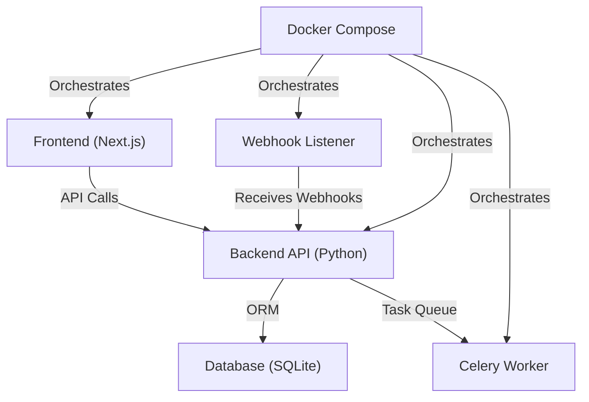

# Project Technical Overview

## 1. Introduction

This project is a full-stack, containerized application designed for managing installment orders, wallets, and webhooks. It is structured for scalability, maintainability, and ease of deployment.

---

## 2. Backend

**Location:** `backend/`

**Tech Stack:**
- Python (likely FastAPI or Flask)
- Celery (for background tasks)
- SQLite (for development/testing)
- Docker

**Key Components:**
- `app/api/endpoints/installments.py`: API routes for installment orders.
- `app/celery_tasks.py`: Background task definitions.
- `app/crud.py`: Database CRUD logic.
- `app/database.py`: Database connection/session management.
- `app/models.py`: ORM models.
- `app/schemas.py`: Data validation/serialization schemas.
- `app/main.py`: Backend API entry point.
- `celery_worker.py`: Celery worker entry point.
- `requirements.txt`: Python dependencies.
- `tests/`: Backend unit/integration tests.

---

## 3. Frontend

**Location:** `frontend/`

**Tech Stack:**
- Next.js (React framework)
- TypeScript
- PostCSS
- Docker

**Key Components:**
- `src/app/`: Main app entry, global styles, layout.
- `src/components/`: Dashboard, Installment Orders, Wallets, Webhook Logs components.
- `src/lib/api.ts`: API utility functions.
- `public/`: Static assets (SVGs, icons).
- `package.json`: Node.js dependencies/scripts.

---

## 4. Listeners

**Location:** `listeners/`

- `webhook_listener.py`: Listens for and processes incoming webhooks (e.g., from payment providers).

---

## 5. Docker & Orchestration

- `docker-compose.yml`: Orchestrates backend, frontend, Celery worker, and possibly database containers.
- `backend/Dockerfile` and `frontend/Dockerfile`: Define container images for backend and frontend.

---

## 6. Database

- `test.db`: SQLite database file for development/testing.

---

## 7. Testing

- `backend/tests/`: Contains tests for backend logic.

---

## 8. General Flow

1. **Frontend** (Next.js) provides the user interface for managing installment orders, wallets, and viewing webhook logs.
2. **Backend API** exposes endpoints for the frontend to interact with data.
3. **Celery** handles background jobs (e.g., processing payments, sending notifications).
4. **Webhook Listener** receives and processes external events (e.g., payment confirmations).
5. **Docker Compose** ties everything together for local development or deployment.

---

## 9. Architecture Diagram

Below is a Mermaid diagram representing the high-level architecture:

---

## 10. Summary

This project is a well-structured, containerized full-stack application with clear separation of concerns between frontend, backend, background processing, and external event handling. It is suitable for scalable deployment and further extension.

---

*For more details, refer to the `TECHNICAL_DOCUMENTATION.md` file or specific source files as needed.* 